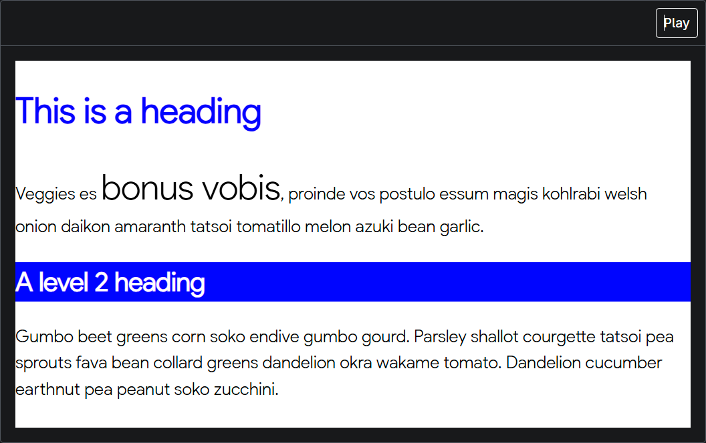
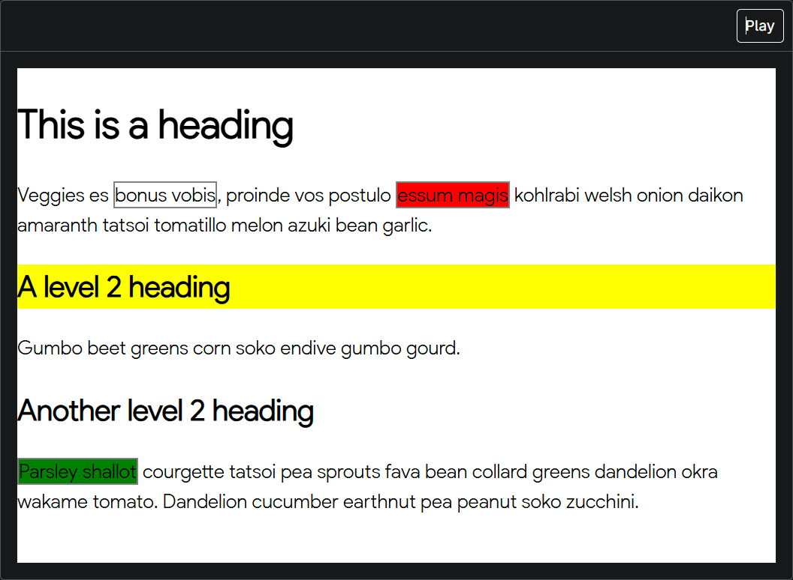
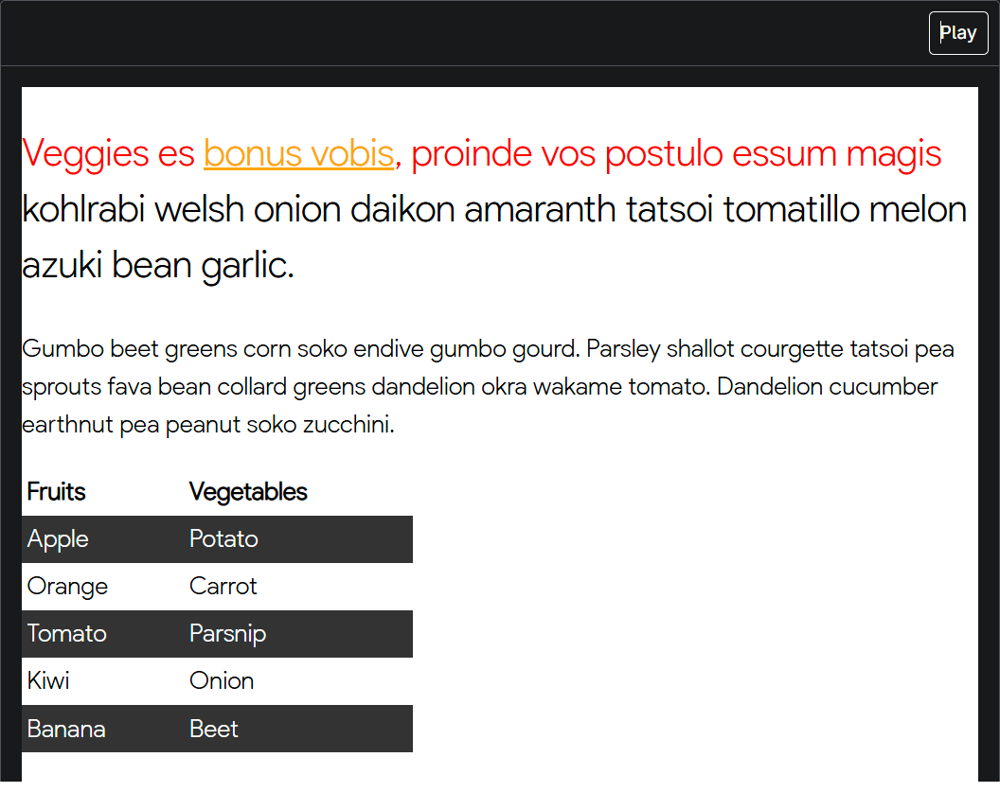
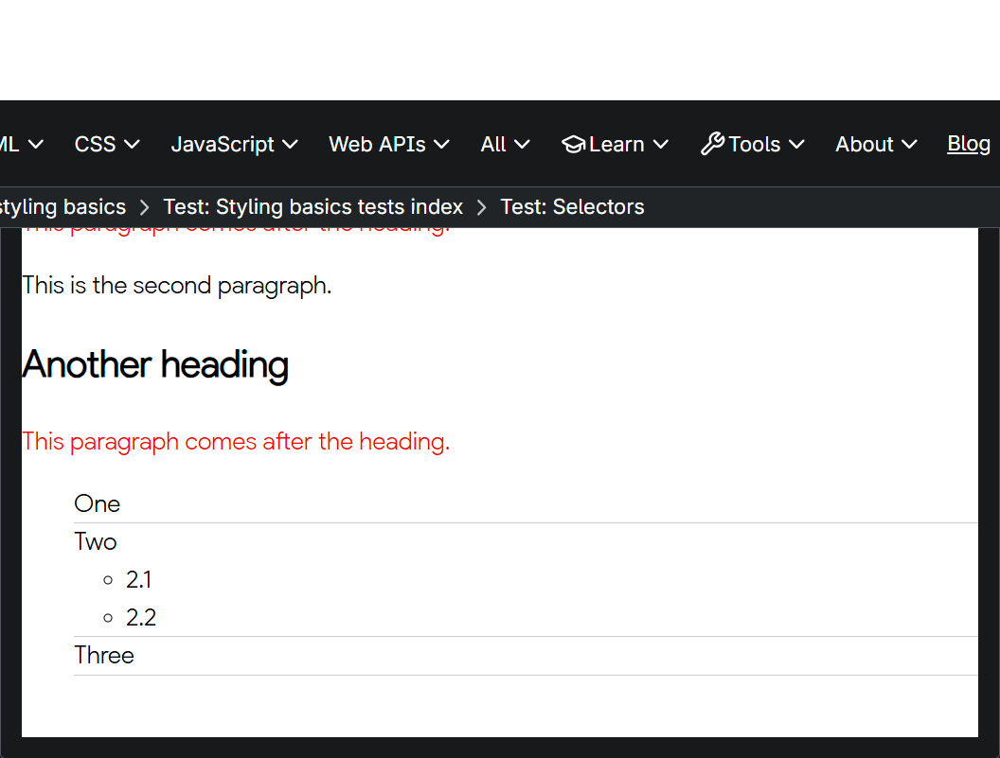
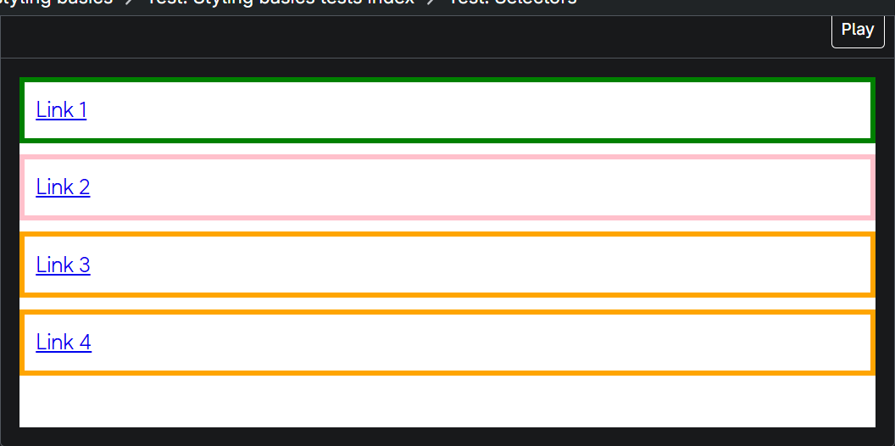

# Selectors 1

To complete the task:
1. Make the `<h1>` headings blue.
2. Give `<h2>` headings a blue background and white text.
3. Cause text wrapped in a `` to have a font-size of 200%.

## Finished

# Selectors 2

To complete the task:
1. Give the element with an id of special a yellow background.
2. Give the element with a class of alert a 2px solid grey border.
3. If the element with a class of alert also has a class of stop, make the background red.
4. If the element with a class of alert also has a class of go, make the background green.

## Finished

# Selectors 3

To complete the task:
1. Style links, making the link-state orange, visited links green, and remove the underline on hover.
2. Make the first element inside the container font-size: 150% and the first line of that element red.
3. Stripe every other row in the table by selecting these rows and giving them a background color of #333333 and foreground white.

## Finished

# Selectors 4

To complete the task:
1. Make any paragraph that directly follows an `<h2>` element red.
2. Style list items that are a direct child of the `<ul>` with a class of list as follows:
3. Remove their bullets.
4. Give them a 1px grey bottom border.

## Finished

# Selectors 5

To complete the task, provide solutions for the following challenges using attribute selectors:
1. Target the `<a>` element with a title attribute and make the border pink `(border-color: pink)`.
2. Target the `<a>` element with an href attribute that contains the word contact somewhere in its value and make the border orange `(border-color: orange)`.
3. Target the `<a>` element with an href value starting with https and give it a green border `(border-color: green)`.

## Finished

